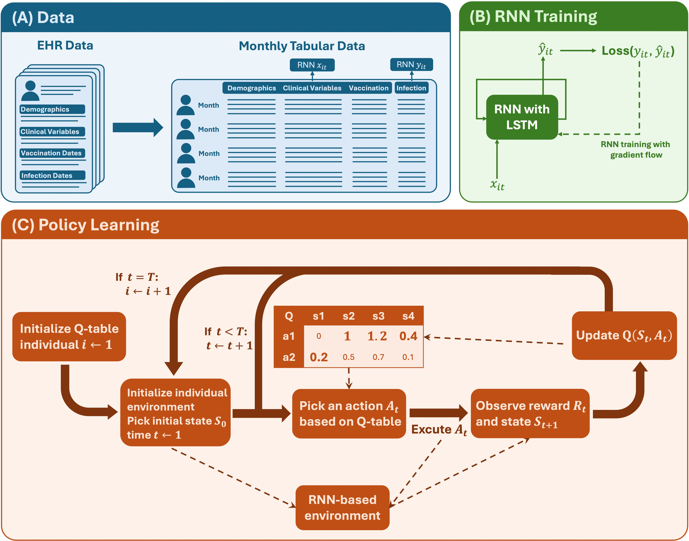

# Digital twin policy learning

This repository provides a simplified and user-friendly implementation of a trajectory-based digital twin policy learning framework, illustrated using a facsimile dataset modeled after the COVID-19 booster policy application in the paper.

---

## Overview

This framework takes long format trajectory data, converts it into model-ready sequential inputs, trains an RNN/LSTM model as a digital twin environment, and then applies tabular Q-learning to learn a policy. The repository is designed as a generic trajectory-based policy learning interface, while the included facsimile COVID booster dataset serves as an end-to-end example. 

---

## Workflow

- Create raw wide format EHR facsmile data (optional, fascmile_data.csv already provided): `preprocess/create_facsmile_data.R`

- Preprocess wide format EHR data (optional, fascmile_data.csv already provided): `preprocess/preprocessing.R`

- Create model ready data: `create_model_ready_data.ipynb`

- Create environment, policy training, evaluation and results reporting: `run.ipynb`

---

## How `run.ipynb` uses the Framework

The example notebook demonstrates a full pipeline:

1. Load `facsimile_model_ready_data.csv`
2. Construct a `TrajectoryDataset` from the processed long format dataset
3. Initialize `MicrosimQLearner`
4. Train or load the RNN model
5. Run or load Q-learning
6. Evaluate policies:
   - learned policy
   - observed policy
   - all inividuals treated
   - none inividual treated
   
---

## Repository Structure

- `digital_twin_policy_learning.py`  
  Core implementation of the framework.  
  This module defines the main classes and functions, including:
  - Data preprocessing into trajectory format
  - RNN-based environment simulator
  - Tabular Q-learning algorithm
  - Policy evaluation methods

- `run.ipynb`  
  End-to-end example demonstrating how to use the framework.  
  This notebook:
  - Loads the sample dataset
  - Builds the learning environment
  - Trains or loads the RNN model
  - Runs or loads Q-learning
  - Evaluates multiple policies

- `create_model_ready_data.ipynb`  
  Provided to create a model-ready version of the facsimile dataset.  
  This notebook:
  - Loads `facsimile_data.csv`
  - Harmonizes the column names used by the example workflow
  - Creates derived variables such as `month_index`, `age_cat`, and `months_since_vax_cat`
  - Standardizes age and generates dummy-variable columns for the RNN covariates
  - Outputs `facsimile_model_ready_data.csv` for use in the example pipeline in `run.ipynb`

- `preprocess/create_data_helpers.R`
  Helper functions to transform wide EHR data into long format. 

- `preprocess/create_facsmile_data.R`
  Code to simulate wide format facsimile electronic health record data (`data/raw_ehr_fascimile_data.rdata`) that can be used to test the pipeline.

- `preprocess/preprocessing.R`
  Code for basic preprocessing, including transforming wide EHR to long EHR, categorization, removing participants with unkonwn gender and race. The output dataset is `data/facsimile_data.csv`.
  
- `data/raw_ehr_fascimile_data.rdata`
  A synthetic dataset with the same structure as the raw EHR data used in the paper, created by `preprocess/create_facsmile_data.R`.

- `data/facsimile_data.csv`  
  A synthethic long EHR data converted from `data/raw_ehr_fascimile_data.rdata` by `preprocess/preprocessing.R`.

- `data/facsimile_model_ready_data.csv`  
  Model-ready facsimile dataset derived from the synthetic long format `data/facsimile_data.csv`. This file contains the processed trajectory data used by the framework after the key variables for RNN covariates, RNN outcomes, and RL states have been organized into a format suitable for direct training and evaluation. It serves as the main example input for demonstrating the end-to-end pipeline in the repository. This dataset is included as the primary example data for demonstrating the generic interface.

- `results/rnn_weights_2_128_2000_1e-04.pth`  
  Pretrained RNN/LSTM model weights used in the facsimile COVID booster example. This file corresponds to a sequence model with 2 stacked LSTM layers, hidden size 128, trained for 2000 epochs with learning rate `1e-4`. It can be loaded directly to reproduce the example workflow without retraining the digital twin environment from scratch.

- `results/q_table.npy`  
  Saved tabular Q-learning policy learned from the facsimile example. This file stores the final Q-table over the discrete RL state space and action space, and can be loaded directly for policy evaluation or visualization. It is included so users can reproduce the learned policy results without rerunning the full Q-learning training procedure.
---

# Main Classes

All core components are defined in `digital_twin_policy_learning.py`.

## 1. `TrajectoryDataset`

This class handles **data preprocessing and representation**.

It converts long-format trajectory data (one row per patient per time step) into:

- padded arrays for RNN training
- per-patient trajectory objects
- mappings from raw variables to discrete RL states

Key functionality:

- `from_long_format(...)`  
  Main entry point. Takes a dataframe and builds the full dataset structure.

- `summary()`  
  Returns dataset statistics (number of patients, sequence length, input/output size, state levels).

This class is responsible for bridging raw data and the learning framework.

---

## 2. `RNNModel`

This is the **sequence model used as the environment simulator**.

It is an LSTM-based neural network that:

- takes patient history as input
- predicts next-step outcomes (e.g., infection risk)

Key methods:

- `forward(x)` → raw logits  
- `predict_proba(x)` → probabilities via sigmoid

After training, this model acts as a **digital twin**, generating simulated outcomes for new action sequences.

---

## 3. `TabularQLearner`

This class implements **tabular Q-learning**.

It maintains a Q-table over discrete states and actions and updates it iteratively.

Key functionality:

- `select_action(state, valid_actions, greedy_only=False)`  
  Chooses an action using epsilon-greedy exploration.

- `update(cur_state, cur_action, reward, next_state)`  
  Applies the standard Q-learning update rule.

The Q-table learned here defines the final policy.

---

## 4. `GenericTrajectoryEnv`

This class defines the **simulation environment** used by the RL agent.

It combines:

- a trained RNN model
- a single patient trajectory
- user-defined rules (reward, transition, constraints)

Key method:

- `step(action)`

This method:

1. updates the trajectory with the chosen action  
2. uses the RNN to predict next-step outcomes  
3. computes the reward  
4. updates the state  
5. determines whether the episode ends  

It returns:

- next state
- reward
- termination flag

This class is the core interaction layer between the RNN and Q-learning.

---

## 5. `MicrosimQLearner`

This is the **main user-facing interface**.

It orchestrates the entire workflow:

- sequence model training/loading
- environment construction
- Q-learning training
- policy evaluation

Key methods:

- `fit_sequence_model(...)`  
  Trains the RNN on trajectory data.

- `load_sequence_model(...)`  
  Loads pretrained RNN weights.

- `fit_tabular_q_learning(...)`  
  Runs Q-learning using the simulated environment.

- `load_q_table(...)`  
  Loads existing q table.

- `evaluate_policy(policy, epochs)`  
  Evaluates a policy (learned or predefined).

- `simulate(...)`  
  Generates simulated trajectories under a policy.

This class is the primary entry point for users.
